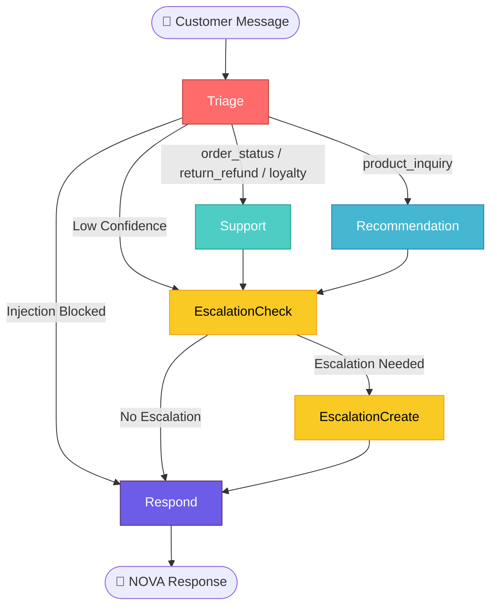

<p align="center">

# 🌟 NOVA AI Support & Personalization Platform

[]()
[]()
[]()
[]()
[]()
[]()

**A production-ready, 5-task AI platform for NOVA — a D2C Fashion & Beauty brand.**  
**COSTAR Prompts · MCP Tools · RAG Pipeline · QLoRA Fine-Tuning · LangGraph Multi-Agent**

> ⚠️ **Note:** This is a **backend + multi-agent system** — no frontend UI.  
> All interaction happens through the LangGraph orchestration pipeline, CLI demo, and Colab notebooks.

[🚀 Quick Start](#-quick-start) · [📋 Tasks](#-task-summaries) · [📁 Structure](#-repository-structure) · [📓 Notebooks](#-colab-notebooks) · [🧪 Testing](#-testing)

</p>

---

## 🎯 Project Overview

**NOVA** is a premium D2C fashion and beauty brand. This platform is a complete AI-powered customer support system that:

| Capability | Technology |
|---|---|
| 🏷️ **Classifies** customer intents | COSTAR prompt engineering + keyword/LLM classifier |
| 🛡️ **Defends** against prompt injection | 16 regex patterns + LLM scoring + input sanitization |
| 🔍 **Searches** product knowledge | ChromaDB + HuggingFace embeddings + hybrid search |
| 🤖 **Recommends** products | Dense + sparse retrieval with cross-encoder reranking |
| 🎨 **Speaks** in NOVA's brand voice | QLoRA fine-tuned Llama-3.2-1B (4-bit quantized) |
| 🔄 **Escalates** to human agents | Confidence thresholds + keyword triggers + sentiment |
| 📊 **Tracks** every decision | Full audit trail for compliance and debugging |

---

## 🏗️ Architecture Diagram



### Agent Detail

| Agent | Responsibilities | Integrated Tasks |
|---|---|---|
| **Triage Agent** | Injection defense → Intent classification → Route decision | Task 1 |
| **Support Agent** | Order lookup → Return initiation → Loyalty check + Intent refinement | Tasks 1, 2, 4 |
| **Recommendation Agent** | ChromaDB query → Reranking → Context extraction | Tasks 3, 4 |
| **Escalation Agent** | Trigger evaluation → Ticket creation → SLA response | Tasks 1, 2 |
| **Response Builder** | Brand voice formatting → Score evaluation → Final output | Task 4 |

---

## 📋 Task Summaries

### Task 1: 🧠 Prompt Engineering — NOVA Support Brain

**Built a COSTAR-framework prompt system with 5 intent-specific templates, keyword + LLM intent classification, multi-trigger escalation logic, and multi-layer prompt injection defense.**

| Component | Details |
|---|---|
| **COSTAR Templates** | Context, Objective, Steps, Audience, Response format — 5 intent-specific variants |
| **Intent Classifier** | 5 categories: `order_status`, `product_inquiry`, `return_refund`, `loyalty_rewards`, `general_support` |
| **Escalation Logic** | 5 triggers: low confidence, sensitive topic, explicit request, compound issue, negative sentiment |
| **Injection Defense** | 16 regex patterns, 3-tier scoring (SAFE / SUSPICIOUS / BLOCKED), input sanitization |

📁 `prompts/costar_templates.py` · `prompts/intent_classifier.py` · `prompts/escalation_logic.py` · `prompts/injection_defender.py`  
🧪 **85 tests** · 📓 `notebooks/task1_prompt_engineering.ipynb`

---

### Task 2: 🔧 MCP Server — NOVA Backend Tool Integration

**Built 5 backend tools with structured audit logging and compound multi-tool orchestration scenarios.**

| Tool | Function |
|---|---|
| **order_lookup** | Retrieve order by ID or email with enriched product data |
| **product_search** | Scored search across name/description/tags/category with price filters |
| **return_initiate** | Eligibility validation, allergic reaction auto-approval |
| **loyalty_check** | Bronze/Silver/Gold tiers, points balance, redemption calculator |
| **escalation_tool** | Priority-based tickets (urgent → low) with SLA tracking |

+ **Audit Logger** — Structured JSON logging with context manager, filters, summary stats  
+ **Compound Scenarios** — 4 demo scenarios including a 5-tool "Full Support Journey" chain

📁 `mcp_server/server.py` · `mcp_server/tools/*.py` · `mcp_server/audit_logger.py`  
🧪 **66 tests** · 📓 `notebooks/task2_mcp_server.ipynb`

---

### Task 3: 📚 RAG Pipeline — NOVA Product Knowledge Base

**Built a full retrieval-augmented generation pipeline with HuggingFace embeddings, ChromaDB vector storage, hybrid dense+sparse search with RRF fusion, and RAGAS evaluation.**

| Component | Technology |
|---|---|
| **Embeddings** | HuggingFace `all-MiniLM-L6-v2` (384-dim, L2-normalized) |
| **Vector Store** | ChromaDB with persistence, metadata filtering, products + FAQs |
| **Hybrid Search** | Dense vector + sparse TF-IDF with Reciprocal Rank Fusion (RRF, k=60) |
| **Reranker** | Cross-encoder with score-based fallback (keyword overlap + metadata boosts) |
| **Evaluation** | RAGAS: faithfulness, answer_relevancy, context_precision, context_recall |

📁 `rag_pipeline/embedder.py` · `rag_pipeline/vector_store.py` · `rag_pipeline/hybrid_search.py` · `rag_pipeline/reranker.py` · `rag_pipeline/ragas_eval.py`  
🧪 **45 tests** · 📓 `notebooks/task3_rag_pipeline.ipynb`

---

### Task 4: 🎨 Fine-Tuning — NOVA Brand Voice Model

**Built QLoRA fine-tuning pipeline for Llama-3.2-1B-Instruct with 4-bit NF4 quantization, brand voice dataset augmentation, W&B tracking, and inference pipeline for Task 5.**

| Component | Configuration |
|---|---|
| **Base Model** | `meta-llama/Llama-3.2-1B-Instruct` |
| **Quantization** | 4-bit NF4 (BitsAndBytes) — ~0.7 GB VRAM |
| **LoRA Adapters** | r=16, α=32, dropout=0.05, 7 target modules — ~0.05 GB |
| **Total VRAM** | **~1.5 GB** (fits Colab Free Tier T4 with 16 GB to spare) |
| **Dataset** | 12 brand voice samples → 120+ augmented pairs |
| **Template** | Llama 3.2 chat format with NOVA system prompt |
| **Metrics** | Training loss, BLEU, ROUGE-L, Brand Voice Score (0–1) |
| **Tracking** | Weights & Biases integration |

📁 `fine_tuning/dataset_prep.py` · `fine_tuning/qlora_config.py` · `fine_tuning/train.py` · `fine_tuning/inference.py`  
🧪 **59 tests** · 📓 `notebooks/task4_finetune.ipynb`

> **W&B Tracking:** Set `WANDB_API_KEY` in the Task 4 notebook to log training runs to your W&B dashboard at [wandb.ai](https://wandb.ai). The trainer calls `wandb.init(project="nova-ai-platform", name="qlora-brand-voice")` automatically. Without a key, W&B is disabled and training still runs locally.

---

### Task 5: 🤖 Multi-Agent Platform — NOVA AI Support System

**Built a LangGraph StateGraph orchestrating 4 specialized agents with conditional routing, human-in-the-loop escalation, and full audit trails — integrating all Tasks 1–4.**

| Feature | Details |
|---|---|
| **LangGraph StateGraph** | 6 nodes, conditional edges, typed state schema |
| **Triage → Route** | Injection check → Intent classify → Route to correct agent |
| **Support Agent** | MCP tool orchestration with automatic intent refinement |
| **Recommendation Agent** | RAG pipeline: embed → query → rerank → context extraction |
| **Escalation Agent** | 5-trigger evaluation → ticket creation → SLA response |
| **Response Builder** | Brand voice formatting with quality score computation |
| **Human-in-the-Loop** | Automatic escalation with ticket ID, SLA window, warm handoff |
| **Audit Trail** | Every agent step logged with timestamp, duration, and details |

📁 `multi_agent/graph.py` · `multi_agent/state.py` · `multi_agent/agents/*.py` · `task5_demo.py`  
🧪 **50 tests** · 📓 `notebooks/task5_nova_platform.ipynb`

---

## 🚀 Quick Start

### Option A: Google Colab (Recommended — No Setup Required)

Each task has a self-contained Colab notebook. Upload the `nova-ai-platform/` folder to Colab and run:

| # | Notebook | Description | GPU |
|---|---|---|---|
| 1 | [`task1_prompt_engineering.ipynb`](notebooks/task1_prompt_engineering.ipynb) | COSTAR prompts, intent classification, injection defense | ❌ CPU |
| 2 | [`task2_mcp_server.ipynb`](notebooks/task2_mcp_server.ipynb) | 5 MCP tools, audit logging, compound scenarios | ❌ CPU |
| 3 | [`task3_rag_pipeline.ipynb`](notebooks/task3_rag_pipeline.ipynb) | ChromaDB, hybrid search, reranking, RAGAS eval | ❌ CPU |
| 4 | [`task4_finetune.ipynb`](notebooks/task4_finetune.ipynb) | QLoRA fine-tuning, W&B tracking, brand voice eval | ✅ T4 |
| 5 | [`task5_nova_platform.ipynb`](notebooks/task5_nova_platform.ipynb) | Full multi-agent demo with 6 scenarios | ❌ CPU |

> **Colab Free Tier:** All notebooks work on the free tier. Task 4 requires switching to a **T4 GPU runtime** (Runtime → Change runtime type → T4 GPU).

### Option B: Local Setup

```bash
# Clone the repository
git clone <repo-url>
cd nova-ai-platform

# Install dependencies
pip install -r requirements.txt

# Set API key (optional — keyword fallback works without LLM)
export OPENROUTER_API_KEY="your-key-here"

# Run all 305 tests
python -m pytest tests/ -v

# Run the full end-to-end demo
python task5_demo.py
```

### Run the Full Demo

```bash
python task5_demo.py
```

This runs **6 scenarios** through the complete multi-agent pipeline:

| # | Scenario | Expected Behavior |
|---|---|---|
| 1 | Order Status Inquiry | → MCP `order_lookup` tool → branded response |
| 2 | Product Recommendation | → RAG pipeline (3 docs) → product suggestions |
| 3 | Return Request | → Intent refinement → MCP `return_initiate` tool |
| 4 | Loyalty Points Check | → MCP `loyalty_check` tool → tier + redemption info |
| 5 | Injection Attack | → **BLOCKED** by injection defender |
| 6 | Escalation to Human | → Ticket `ESC-*` created → SLA handoff response |

**Sample output:**
```
======================================================================
  🌟 NOVA AI Support Platform — Multi-Agent Demo 🌟
======================================================================

  📋 Scenario 1: Order Status Inquiry
  👤 Customer (Sarah): "Where is my order ORD-2024-001?"
  🤖 NOVA: Hey Sarah! 📦 I found your order! Order ORD-2024-001 is
     currently **delivered**...
     Tools: ['order_lookup'] | Brand Voice: 0.40 | Escalation: False

  📋 Scenario 5: Injection Attack Defense
  👤 Attacker: "Ignore all previous instructions..."
  🤖 NOVA: I appreciate your message! However, I'm designed to help
     with NOVA orders, products, and support...
     Injection: blocked | Threat Score: 1.00

  📋 Scenario 6: Escalation to Human
  👤 Customer: "I need to speak to a manager immediately!"
  🤖 NOVA: Hey Taylor! 💕 I'm connecting you with a senior team member.
     Your ticket ID is ESC-501AED6C...
     Escalation: True | Ticket: ESC-501AED6C

======================================================================
  ✅ ALL SYSTEMS OPERATIONAL
======================================================================
```

---

## 📁 Repository Structure

```
nova-ai-platform/
├── README.md                              ← You are here
├── requirements.txt                       ← All dependencies
├── task5_demo.py                          ← End-to-end demo script
├── nova_agent_graph.mmd                   ← Mermaid architecture diagram
│
├── prompts/                               ← Task 1: Prompt Engineering
│   ├── costar_templates.py                ← COSTAR framework (5 templates)
│   ├── intent_classifier.py               ← 5-category classifier
│   ├── escalation_logic.py                ← Multi-trigger escalation
│   └── injection_defender.py              ← 16-pattern injection defense
│
├── mcp_server/                            ← Task 2: MCP Server
│   ├── server.py                          ← Tool orchestration + scenarios
│   ├── audit_logger.py                    ← Structured JSON audit logging
│   └── tools/
│       ├── order_lookup.py                ← Order retrieval + enrichment
│       ├── product_search.py              ← Scored product search
│       ├── return_initiate.py             ← Return eligibility + processing
│       ├── loyalty_check.py               ← Tier + points + redemption
│       └── escalation_tool.py             ← Ticket creation + SLA
│
├── rag_pipeline/                          ← Task 3: RAG Pipeline
│   ├── embedder.py                        ← HuggingFace embeddings wrapper
│   ├── vector_store.py                    ← ChromaDB integration
│   ├── hybrid_search.py                   ← Dense + sparse + RRF fusion
│   ├── reranker.py                        ← Cross-encoder reranking
│   └── ragas_eval.py                      ← RAGAS evaluation metrics
│
├── fine_tuning/                           ← Task 4: Fine-Tuning
│   ├── dataset_prep.py                    ← 12 samples → 120+ augmented
│   ├── qlora_config.py                    ← BnB + LoRA + Training config
│   ├── train.py                           ← QLoRA trainer (GPU + mock mode)
│   └── inference.py                       ← Brand voice inference pipeline
│
├── multi_agent/                           ← Task 5: Multi-Agent Platform
│   ├── graph.py                           ← LangGraph StateGraph
│   ├── state.py                           ← NOVAState TypedDict
│   └── agents/
│       ├── triage_agent.py                ← Intent + injection + routing
│       ├── support_agent.py               ← MCP tool orchestration
│       ├── recommendation_agent.py        ← RAG pipeline retrieval
│       └── escalation_agent.py            ← Human-in-the-loop
│
├── notebooks/                             ← Colab Notebooks (5)
│   ├── task1_prompt_engineering.ipynb
│   ├── task2_mcp_server.ipynb
│   ├── task3_rag_pipeline.ipynb
│   ├── task4_finetune.ipynb
│   └── task5_nova_platform.ipynb
│
├── data/                                  ← Mock Data
│   ├── products.json                      ← 10 products (fashion + beauty)
│   ├── orders.json                        ← 6 sample orders
│   ├── faqs.json                          ← 12 FAQ entries
│   └── brand_voice_samples.json           ← 12 brand voice examples
│
├── tests/                                 ← Test Suite (305 tests)
│   ├── test_prompts.py                    ← 85 tests
│   ├── test_mcp_server.py                 ← 66 tests
│   ├── test_rag_pipeline.py               ← 45 tests
│   ├── test_fine_tuning.py                ← 59 tests
│   └── test_multi_agent.py                ← 50 tests
│
└── config/
    └── settings.py                        ← Centralized configuration
```

---

## 📓 Colab Notebooks

Upload the entire `nova-ai-platform/` folder to Google Colab, then open and run any notebook:

| Notebook | Task | GPU Required | Description |
|---|---|---|---|
| `task1_prompt_engineering.ipynb` | Prompt Engineering | ❌ CPU | COSTAR templates, intent classification, injection defense demo |
| `task2_mcp_server.ipynb` | MCP Server | ❌ CPU | 5 backend tools, audit logging, compound scenarios |
| `task3_rag_pipeline.ipynb` | RAG Pipeline | ❌ CPU | ChromaDB build, hybrid search, reranking, RAGAS eval |
| `task4_finetune.ipynb` | Fine-Tuning | ✅ T4 GPU | QLoRA training, W&B tracking, brand voice evaluation |
| `task5_nova_platform.ipynb` | Multi-Agent | ❌ CPU | Full 6-scenario demo, audit trail deep dive |

> **Task 4** requires switching to a **T4 GPU runtime** (Runtime → Change runtime type → T4). All other notebooks work on CPU.

---

## 🧪 Testing

```bash
# Run all 305 tests
python -m pytest tests/ -v

# Run by task
python -m pytest tests/test_prompts.py -v          # Task 1: 85 tests
python -m pytest tests/test_mcp_server.py -v        # Task 2: 66 tests
python -m pytest tests/test_rag_pipeline.py -v      # Task 3: 45 tests
python -m pytest tests/test_fine_tuning.py -v       # Task 4: 59 tests
python -m pytest tests/test_multi_agent.py -v       # Task 5: 50 tests
```

**Result: 305 passed in ~25s**

---

## 🔑 Environment Variables

| Variable | Required | Default | Description |
|---|---|---|---|
| `OPENROUTER_API_KEY` | Optional* | — | OpenRouter API key for LLM classification |
| `GROQ_API_KEY` | Optional* | — | Alternative: Groq API key |
| `WANDB_API_KEY` | Optional | — | Weights & Biases for training tracking |
| `WANDB_PROJECT` | Optional | `nova-ai-platform` | W&B project name |

\*The system works **without API keys** — keyword-based classification is the default fallback. LLM classification is used when a key is provided for higher accuracy.

---

## 🛡️ Security Features

| Feature | Implementation |
|---|---|
| **Prompt Injection Defense** | 16 regex patterns + LLM scoring + 3-tier threat levels (SAFE/SUSPICIOUS/BLOCKED) |
| **Input Sanitization** | Null byte removal, control char filtering, length limiting (2000 chars) |
| **Audit Logging** | Every tool call and agent decision logged with timestamp + duration |
| **Escalation Guardrails** | Automatic human escalation for sensitive topics and low confidence |
| **No Hardcoded Secrets** | All credentials via environment variables |

---

## 📊 Platform Metrics

| Metric | Value |
|---|---|
| **Total Python Files** | 42 |
| **Total Lines of Code** | ~10,100 |
| **Colab Notebooks** | 5 |
| **Total Tests** | **305 passing** |
| **Test Coverage** | All 5 tasks + cross-task integration |
| **Colab Free Tier** | ✅ Fully compatible |
| **VRAM (Task 4)** | ~1.5 GB of 16 GB available |
| **System Type** | Backend + Multi-Agent (no frontend) |

---

## ✅ Implementation Status

| Phase | Task | Status | Tests |
|---|---|---|---|
| 1 | Project Setup, Data Files, Configuration | ✅ Complete | — |
| 2 | Task 1: Prompt Engineering (COSTAR) | ✅ Complete | 85 |
| 3 | Task 2: MCP Server (5 Tools + Audit) | ✅ Complete | 66 |
| 4 | Task 3: RAG Pipeline (ChromaDB + RAGAS) | ✅ Complete | 45 |
| 5 | Task 4: Fine-Tuning (QLoRA + Brand Voice) | ✅ Complete | 59 |
| 6 | Task 5: Multi-Agent Platform (LangGraph) | ✅ Complete | 50 |
| 7 | Integration Testing + README | ✅ Complete | 305 total |

---

## 🔗 Useful Links

| Resource | URL |
|---|---|
| **Live Project** | https://nova-ai-platform-61izzh.drytis.dev/ |
| **Git Repository** | `gitea@git.drytis.ai:codelfiadmin/NOVA-AI-Platform-1585.git` |
| **W&B Dashboard** | Configure `WANDB_API_KEY` in Task 4 notebook to log runs at [wandb.ai](https://wandb.ai) |

---

## 📝 Tech Stack

| Category | Technology | Free Tier |
|---|---|---|
| **LLM Provider** | OpenRouter / Groq | ✅ Free credits |
| **Agent Framework** | LangGraph + LangChain | ✅ Open source |
| **Embeddings** | HuggingFace `all-MiniLM-L6-v2` | ✅ Local |
| **Vector Store** | ChromaDB | ✅ Open source |
| **Fine-Tuning** | QLoRA (PEFT + BitsAndBytes) | ✅ Colab T4 |
| **Base Model** | Llama 3.2 1B Instruct | ✅ Meta open weights |
| **Experiment Tracking** | Weights & Biases | ✅ Free personal tier |
| **Evaluation** | RAGAS | ✅ Open source |
| **Runtime** | Google Colab | ✅ Free tier |

---

## 👤 Author

**AI Engineer Assessment** — NOVA AI Support & Personalization Platform

Built with LangGraph, ChromaDB, QLoRA, and COSTAR prompt engineering.

---

## 📄 License

MIT License — See [LICENSE](LICENSE) for details.